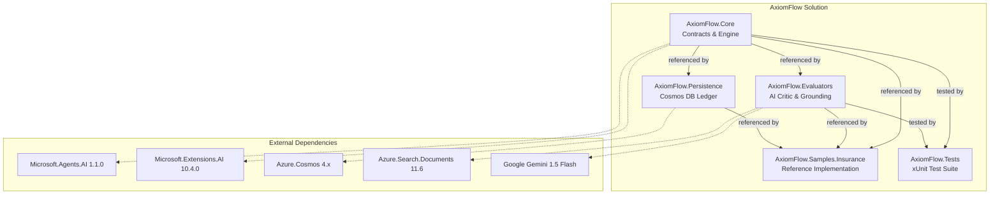
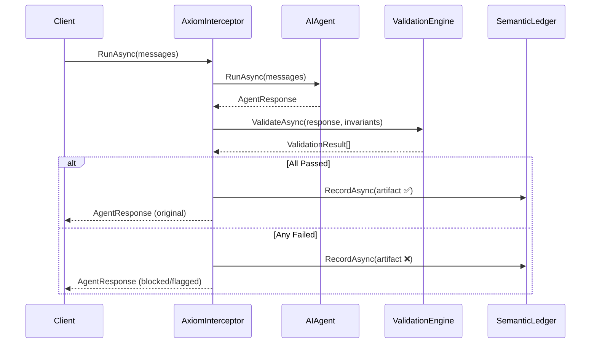

# Axiom-Flow

**Axiom-Flow** is an open-source, contract-based semantic validation framework for Agentic AI workflows. It moves AI development from probabilistic "prompting" to deterministic "agentic architecture" by intercepting agent outputs and validating them against **Semantic Invariants**.

## 🚀 Core Mission

AI agents often produce non-deterministic outputs. Axiom-Flow provides a safety layer that:
1. **Intercepts** agent "Thought-Action-Observation" loops.
2. **Validates** the reasoning and outputs against business-defined invariants.
3. **Persists** validation results into a Semantic Ledger for audit and observability.

---

## ⚖️ The Problems We Solve

Traditional Agentic AI development suffers from **probabilistic drift**. Axiom-Flow provides deterministic guardrails:

- **Business Rule Enforcement**: Hardcode invariants (like "Max 15% discount") that LLMs often ignore when under pressure or "jailbroken" by prompts.
- **Auditability Gap**: The **Semantic Ledger** provides a high-fidelity audit trail of *why* an agent made a decision, not just what the final output was.
- **Hallucination Prevention**: Use the `GroundingEvaluator` to cross-reference agent thoughts against internal knowledge bases before they manifest as actions.
- **Operational Safety**: Middleware can **Block** or **Refer** unsafe actions to human supervisors before downstream tools are invoked.
- **Contextual Reasoning Check**: Validate the *thought process* (Internal Monologue) of the agent, ensuring the "logic" aligns with the "action".

---

## ✨ Key Features

- **🛡️ Contract-Based Safety**: Define hard business invariants that AI agents must follow.
- **📜 Policy-as-Code (DSL)**: Allow business analysts to define and update rules in JSON without redeploying code.
- **📊 Embedded Validation Dashboard**: Real-time monitoring and testing playground for your agent's semantic health.
- **📒 Semantic Ledger**: Session-scoped, Cosmos DB-backed audit trail for every validation event.
- **🔌 Microsoft Agent Framework Middleware**: Zero-trust interception for `AIAgent` pipelines.
- **📉 Deterministic & Probabilistic Evaluators**: Support for both fast regex-based rules and deep LLM-based critique.

---

## 🏛 Solution Architecture



---

## 🛠 Tech Stack

- **Backend:** C# / .NET 9 (LTS)
- **Orchestration Support:** Microsoft Agent Framework, Microsoft Extensions AI
- **Persistence:** Azure Cosmos DB (Semantic Ledger)
- **Search/Grounding:** Azure AI Search
- **Observability:** OpenTelemetry & Structured JSON Logging
- **Testing:** xUnit, Moq, FluentAssertions

---

## 📁 Solution Structure

The project follows a CLEAN architectural pattern:

- **`AxiomFlow.Core`**: The heart of the framework. Contains interfaces (`IAxiomEvaluator`, `ISemanticInvariant`), the validation engine, and the `AxiomInterceptor` middleware.
- **`AxiomFlow.Evaluators`**: Specialized validation logic.
  - `AICriticEvaluator`: Uses a lightweight LLM (Gemini 1.5 Flash) to critique agent reasoning.
  - `GroundingEvaluator`: Verifies outputs against Azure AI Search results to prevent hallucinations.
- **`AxiomFlow.Persistence`**: Cosmos DB implementation of the `ISemanticLedger`.
- **`AxiomFlow.Samples.Insurance`**: A reference implementation featuring a **Commercial Lines Underwriter Agent** with a `PremiumThresholdInvariant`.
- **`AxiomFlow.Tests`**: Comprehensive unit test suite.

---

## 🧩 Core Concepts

### Axiom Interceptor — Middleware Design

The interceptor wraps the Microsoft Agent Framework's `AIAgent.RunAsync` pipeline:



Supports three failure behaviors via `AxiomInterceptorOptions`:
- **Block**: Rejects the agent response if validation fails.
- **Flag**: Allows the response but logs/persists the failure.
- **Referral**: Flags the response for human-in-the-loop review.

### Key Contracts

#### `IAxiomEvaluator`
Defines a semantic evaluator that assesses agent output against a specific dimension.
```csharp
public interface IAxiomEvaluator
{
    string Name { get; }
    Task<ValidationResult> EvaluateAsync(InvariantContext context, CancellationToken ct);
}
```

#### `ISemanticInvariant`
Defines a business rule (semantic invariant) that must hold true. Invariants define *what* to check; evaluators define *how* to check.
```csharp
public interface ISemanticInvariant
{
    string Name { get; }
    string Description { get; }
    InvariantContext BuildContext(string thought, string action, string observation);
    bool ShouldApply(string agentAction);
}
```

### Core Data Models

#### `ValidationResult`
Immutable result of a single evaluator's assessment. Includes a score (0.0 - 1.0) and analysis.

#### `ValidationArtifact` (Ledger Entry)
A structured log entry that links a user prompt to its semantic validation status, persisted to Cosmos DB. Partitioned by `sessionId` for optimal query locality.

---

## 🚦 Getting Started

### Prerequisites

1. **.NET 9 SDK**
2. **Azure Cosmos DB Emulator** (running locally)
3. **Azure AI Search** (optional, for grounding)

### Configuration

Update `src/AxiomFlow.Samples.Insurance/appsettings.json` with your connection strings. The default is configured for the Cosmos DB Emulator.

### Running the Sample API & Dashboard

1. Start the project:
   ```bash
   dotnet run --project src/AxiomFlow.Samples.Insurance/AxiomFlow.Samples.Insurance.csproj --urls "http://localhost:5100"
   ```

2. Open your browser to **http://localhost:5100**.

3. Use the **🎬 Demo Scenarios** to test the `PremiumThreshold` invariant (try the 10% Pass vs. 20% Fail cases).

---

## ✅ Build & Test Status

> [!TIP]
> All phases complete. Solution compiles with **0 errors, 0 warnings**. All **19 unit tests pass**.

| Phase | Status | Deliverables |
|---|---|---|
| Phase 1 — Foundation | ✅ Complete | Core contracts, models, `AxiomValidationEngine`, 7 engine tests |
| Phase 2 — Middleware & Evaluators | ✅ Complete | `AxiomInterceptor`, `AICriticEvaluator`, `GroundingEvaluator` |
| Phase 3 — Persistence | ✅ Complete | `CosmosLedgerProvider`, DI extensions, emulator config |
| Phase 4 — Insurance Sample | ✅ Complete | `PremiumThresholdInvariant`, Minimal API, 12 invariant tests |
| Phase 5 — CI/CD | ✅ Complete | `axiom-gate.yml` GitHub Actions pipeline |

---

## ⚖️ Resolved Design Decisions

| # | Question | Decision |
|---|---|---|
| 1 | **Cosmos DB** | Local Emulator with well-known connection string. |
| 2 | **Gemini Integration** | `IChatClient` via `Microsoft.Extensions.AI` (provider-agnostic). |
| 3 | **Failure Behavior** | **Configurable** — `Block`, `Flag`, `Referral` behaviors. |
| 4 | **Telemetry** | `ILogger` structured JSON + `ActivitySource` OpenTelemetry spans. |
| 5 | **Sample Format** | **Minimal API** with `/api/validate` and `/api/sessions/{id}/artifacts`. |

---

## 🚀 Roadmap: Towards a Full-Fledged Platform

To transform Axiom-Flow from a framework into a comprehensive Agentic Governance platform, we are exploring the following value-adds:

- **[ ] Human-in-the-Loop (HITL) Dashboard**: A dedicated UI for supervisors to review "Referral" status validations and provide manual overrides.
- **[ ] Semantic Replay & Debugging**: Tools to "replay" failed ledger sessions against refined invariants to optimize agent performance.
- **[x] Policy-as-Code (DSL)**: Allow business analysts to define invariants via a YAML/JSON schema instead of C# code. (Implemented in `AxiomFlow.Core.Engine.DynamicSemanticInvariant`)
- **[ ] Self-Correction Loops**: Automatically feed validation failures back into the agent's context as "Critical Feedback" for immediate self-correction.
- **[ ] Multi-Agent Consensus**: An evaluator that runs the same invariant across multiple different LLMs and requires consensus for a "Pass" result.
- **[ ] Cost & Latency Tracking**: Metrics integration to track the overhead of validation vs. the business value of safety.

